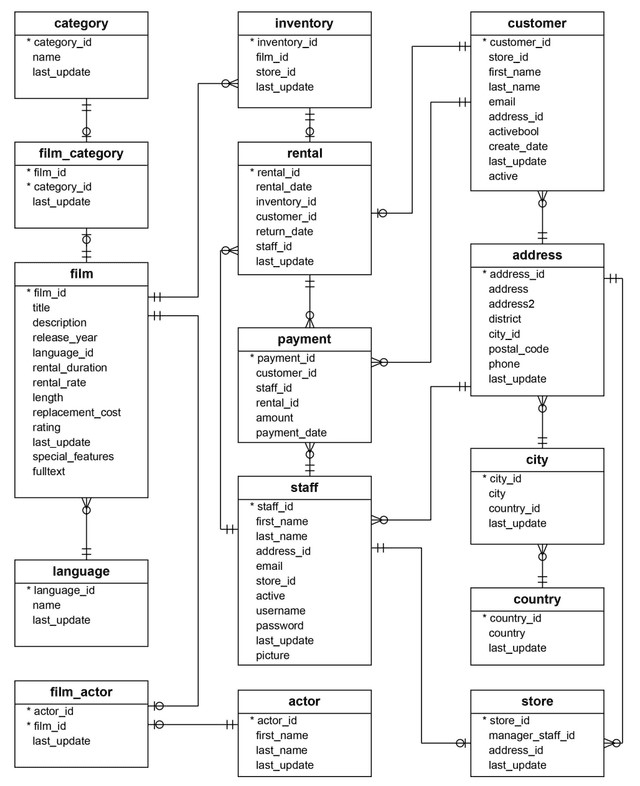

### PostgreSQL Data Analytics Project


---

## Business Scenario

The `dvdrental` database is a real-world-style relational schema for a DVD rental business — 15 tables covering films, customers, staff, stores, inventory, rentals, and payments. The brief: restore the database in PostgreSQL, explore its structure, and answer a progression of business questions — from simple lookups to multi-table joins, aggregations, and filtered analysis — using clean, readable SQL.

---

## Key Findings

| Question | Answer |
|---|---|
| Top Customer by Spend | **Eleanor Hunt — $211.55** |
| Most-Rented Film | **Bucket Brotherhood — 34 rentals** |
| Top 3 Rented Categories | **Sports, Animation, Action** |
| Films Never Rented | **42 films (~4% of catalogue)** |
| Central Fact Tables | **`rental` and `payment`** — nearly every business question flows through one or both |

---

## Project Structure
dvd-rental-sql-analysis/
dvd_rental_queries.sql          (All 24 queries — Task 1 exploration + Task 2 & 3)
Database_Schema_Notes.md        (Schema breakdown: primary/foreign keys across 7 tables)
SQL_Query_Highlights.docx       (6 handpicked queries with results + business insight)
assets/
er_diagram.png                (Database ER diagram)
README.md

---

## Database Exploration (Task 1)

Before writing analytical queries, I explored the schema using `SELECT * FROM table_name LIMIT 10;` on each core table and mapped the relationships from the ER diagram below.

<p align="center">
  
</p>

Full key breakdown in [`Database_Schema_Notes.md`](Database_Schema_Notes.md) — covering 7 tables (more than the required 5), including:

- `rental` and `payment` act as the two central fact tables connecting customers, staff, and films to actual transactions
- `film_category` and `film_actor` are junction tables with composite primary keys, handling many-to-many relationships
- Geography cascades three levels deep: `address → city → country`

---

## Query Highlights

**Task 2 — Foundations (16 queries):** SELECT, WHERE, ORDER BY, DISTINCT, COUNT, GROUP BY, HAVING — covering everything from simple lookups to conditional aggregation (e.g. ratings with 200+ films, films with 5+ actors).

**Task 3 — Advanced Analysis (8 queries):** Multi-table JOINs across customer, payment, rental, inventory, film, and category tables, using GROUP BY, HAVING, LEFT JOIN (for gap analysis), and correlated subqueries.

A few standouts (full write-up with results in `SQL_Query_Highlights.docx`):

**Top 5 Customers by Payment**
```sql
SELECT c.first_name || ' ' || c.last_name AS customer_name,
       SUM(p.amount) AS total_paid
FROM customer c
JOIN payment p ON c.customer_id = p.customer_id
GROUP BY c.first_name, c.last_name
ORDER BY total_paid DESC
LIMIT 5;
```
Eleanor Hunt leads at $211.55, with the top 5 clustered tightly together — spend is spread across a small group of loyal customers rather than concentrated in one outlier.

**Films Never Rented**
```sql
SELECT f.title
FROM film f
LEFT JOIN inventory i ON f.film_id = i.film_id
LEFT JOIN rental r ON i.inventory_id = r.inventory_id
WHERE r.rental_id IS NULL;
```
42 films — about 4% of the catalogue — have never been rented, representing dead inventory worth flagging for promotional pricing or removal.

**Categories with Above-Average Film Length**
```sql
SELECT cat.name AS category, ROUND(AVG(f.length), 2) AS avg_length
FROM film f
JOIN film_category fc ON f.film_id = fc.film_id
JOIN category cat ON fc.category_id = cat.category_id
GROUP BY cat.name
HAVING AVG(f.length) > (SELECT AVG(length) FROM film)
ORDER BY avg_length DESC;
```
Uses a subquery inside `HAVING` to compare each category against the overall catalogue average dynamically, rather than hardcoding a threshold.

---

## Tools & Skills Demonstrated

| Area | Detail |
|---|---|
| **Tool** | PostgreSQL 15.3, pgAdmin 4 |
| **Core SQL** | SELECT, WHERE, ORDER BY, DISTINCT, LIMIT, GROUP BY, HAVING |
| **Joins** | INNER JOIN, LEFT JOIN (gap/anti-join analysis) across up to 4 tables |
| **Aggregation** | COUNT, SUM, AVG, correlated subqueries |
| **Date Handling** | DATE_TRUNC, EXTRACT for time-based aggregation |
| **Schema Analysis** | ER diagram interpretation, primary/foreign key mapping |

---

## About

Built as part of the **Newto Training Data Analytics Course** — Week 2 Project (SQL/PostgreSQL).

*Adarsh Kumar Singh — 2026*
Let me know once it's committed and we'll do a final check of all three repos, then move to pinning them in order on your profile.
